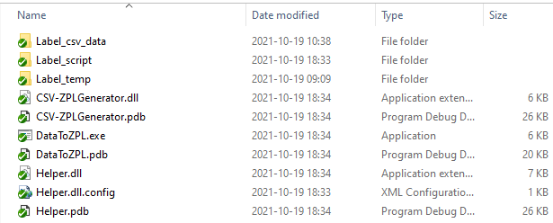
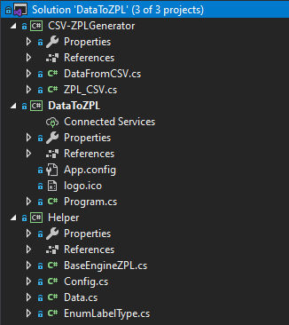
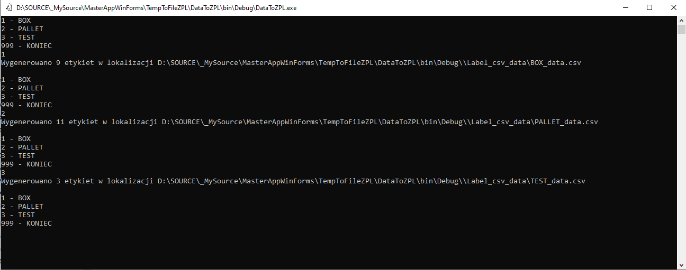
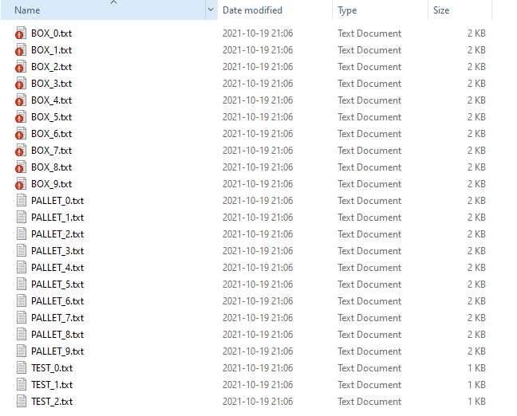
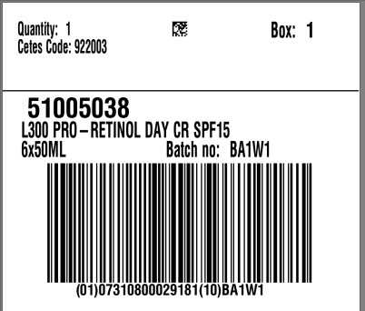
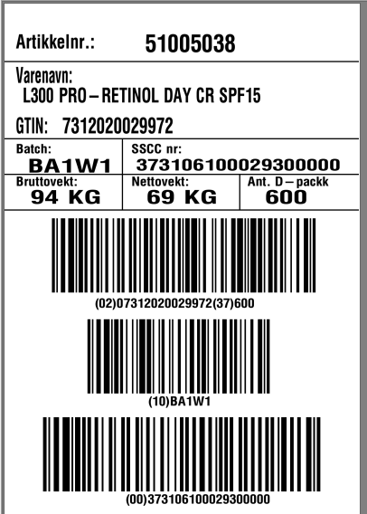

# **DataToZPL - console code**

Aplikacja konsolowa stworzona w .NET 4.8 ktora pobiera dane z pliku CSV i podstawia je do szablonu kodu ZPL znajdujacego sie w pliku txt.

Przykladowe dane z pliku CSV.

Pierwsza linia w pliku to naglowek w ktorym zdefiniowane sa elementy ktore zostana zamienione przez program na wartosci ponizej.

Dla przykladu dla wartosci

**^FH\^FD ITEM_NUMBER_CUSTOMER ^FS **

w pliku txt z kodem ZPL zostanie podstawiona wartosc

**^FH\^FD 51005038 ^FS**

| ^FH\^FD ITEM_NUMBER_CUSTOMER ^FS | ^FH\^FD ITEM_DESCRIPTION ^FS              | ^FH\^FD PIECES_PER_PACKAGE ^FS | ^FH\^FD BATCH ^FS | ^FH\^FD (01)0GTIN(10)BATCH ^FS          | ^FH\^FD ITEM_NUMBER_CETES ^FS | ^FH\^FD BOX ^FS | ^FH\^FD (01)0GTIN>8(10)BATCH ^FS          | ^FH\^FD_19201^MO_LINE_KEY^_111^MANUFACTURING_yyMMdd^17^EXPIRY_yyMMdd^10^BATCH^^FS |
| -------------------------------- | ----------------------------------------- | ------------------------------ | ----------------- | --------------------------------------- | ----------------------------- | --------------- | ----------------------------------------- | --------------------------------------------------------------------------------- |
| ^FH\^FD 51005038 ^FS             | ^FH\^FD L300 PRO-RETINOL DAY CR SPF15 ^FS | ^FH\^FD 6x50ML ^FS             | ^FH\^FD BA1W1 ^FS | ^FH\^FD (01)07310800029181(10)BA1W1 ^FS | ^FH\^FD 922003 ^FS            | ^FH\^FD 1 ^FS   | ^FH\^FD (01)07310800029181>8(10)BA1W1 ^FS | ^FH\^FD_19202^123_111^210922^17^210922^10BA1W1^^FS                                |

Stworzone foldery i pliki:

**Label_csv_data**

BOX_dataBox - CSV

PALLET_data - CSV

TEST_data - CSV

**Label_script**

BOX_0 - TXT

BOX_1 - TXT

...

BOX_X - TXT

**Label_temp**

BOX_label - TXT

PALLET_label - TXT

Pliki i foldery powinny znajdowac w katalogu razem z plikiem exe nazwy plikow nie powinny ulegac zmianom.

Struktura projektu:

Projekt zostal podzielony na 3 rozwiazania.

CSV-ZPLGenerator - w rozwiazaniu znajdujaznjduja sie klasy odpowiedzialne za odczytanie oraz odpowiednie przygotowanie plikow z CSV

DataToZPL - w rozwiazaniu znajduja sie klasy odpowiedzialne za skopiowanie szablonu a nastepnie podmiane danych w plikach txt

Helper - w rozwiazaniu znajduja sie klasy odpowiedzialne za odczytanie z wyzej wymionionych katalogow plikow CSV , TXT

Po uruchomieniu aplikacji uzytkownik wybiera rodzaj etykiety do wygenerowania na podstawie szablonu z folderu Label_temp

aplikacja kopiuje do katalogu Label_script wybrany rodzaj etykiet a nastepnie podmienia w nich dane na te z pliku CSV.

Rezultat

